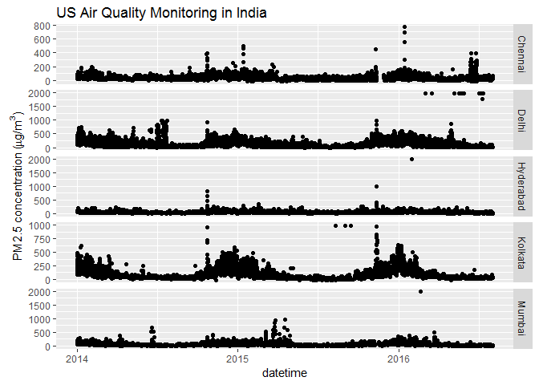

usaqmindia
==========

The U.S. Embassy and Consulates General in India maintain an air quality monitoring program with on-site measuring instruments and put the corresponding data [on this website](http://newdelhi.usembassy.gov/airqualitydata.html). There are csv files for 2013 and 2014, for 2015 except December which is in a pdf, and various csv for the months of the beginning of 2016.

In this repository I have made a copy of these files and provide a R code for wrangling them to get a single csv with all measures for Delhi, Mumbai, Kolkata, Hyderabad and Chennai. Refer to original source for licensing questions.

You will find the raw data [in this folder](inst/extdata) and my wrangling code is [here](inst/pm25_consulate.R). The resulting csv is [here](inst/pm25USA.csv).

I have made a R package out of the data so that my fellow R users can easily play with the data.

The data is in a long format:

``` r
library("usaqmindia")
library("dplyr")
data("pm25_india")
pm25_india %>% head(n = 20) %>% knitr::kable()
```

| datetime            | city  |   conc|
|:--------------------|:------|------:|
| 2013-01-01 01:00:00 | Delhi |  324.4|
| 2013-01-01 02:00:00 | Delhi |  366.8|
| 2013-01-01 03:00:00 | Delhi |  290.7|
| 2013-01-01 04:00:00 | Delhi |  245.4|
| 2013-01-01 05:00:00 | Delhi |  220.3|
| 2013-01-01 06:00:00 | Delhi |  180.2|
| 2013-01-01 07:00:00 | Delhi |  140.0|
| 2013-01-01 08:00:00 | Delhi |  125.0|
| 2013-01-01 09:00:00 | Delhi |  111.0|
| 2013-01-01 10:00:00 | Delhi |  112.0|
| 2013-01-01 11:00:00 | Delhi |  129.4|
| 2013-01-01 00:00:00 | Delhi |  184.1|
| 2013-01-01 01:00:00 | Delhi |  284.8|
| 2013-01-01 02:00:00 | Delhi |  372.3|
| 2013-01-01 03:00:00 | Delhi |  456.7|
| 2013-01-01 04:00:00 | Delhi |  404.8|
| 2013-01-01 05:00:00 | Delhi |  328.1|
| 2013-01-01 06:00:00 | Delhi |  274.4|
| 2013-01-01 07:00:00 | Delhi |  285.0|
| 2013-01-01 08:00:00 | Delhi |  354.9|

Here is an example plot of daily average concentrations (see the code here):

``` r
library("usaqmindia")
redo_plot()
```

<!-- -->
